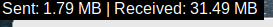

# Python_data_checker (only for Linux)

check Data consumption using python

***

# Install Liabraries

tkinter:

pip install tkinter
  
install rich:

pip install rich
  
***
and run the file using:

python3 data.py

or

put the data_usage.desktop file in /usr/share/applications/

Replace "MyApp" with the name of your application, "/path/to/python" with the path to the Python interpreter, "/path/to/myapp.py" with the path to your Python file, "/path/to/icon.png" with the path to the icon for your application,

make it executable by running the following command in a terminal:

chmod +x myapp.desktop

Move the file to the appropriate location for desktop entries, which is usually "/usr/share/applications/" or "~/.local/share/applications/". You can use the following command to move the file to "/usr/share/applications/":

sudo mv myapp.desktop /usr/share/applications/

Your application should now appear in the application launcher or menu. Click on it to run your Python file.

***

Note: You may need to install the "xdg-utils" package to use the "xdg-open" command, which is used by the desktop environment to launch applications.
